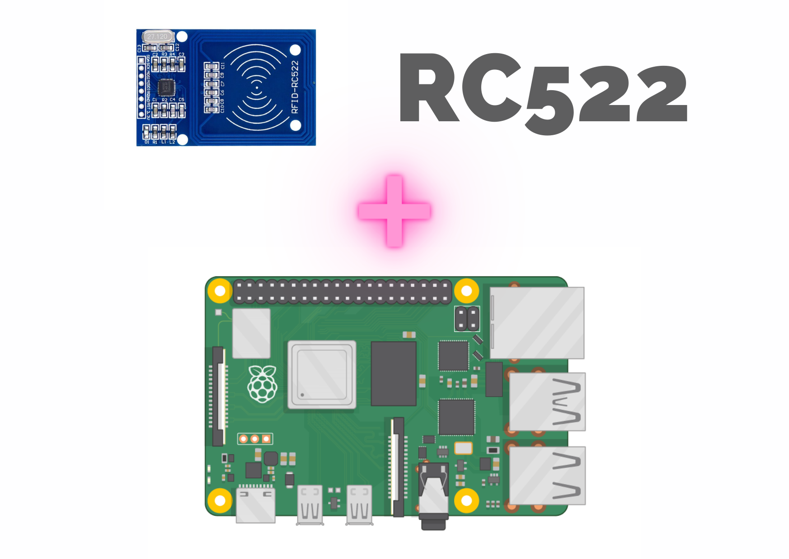
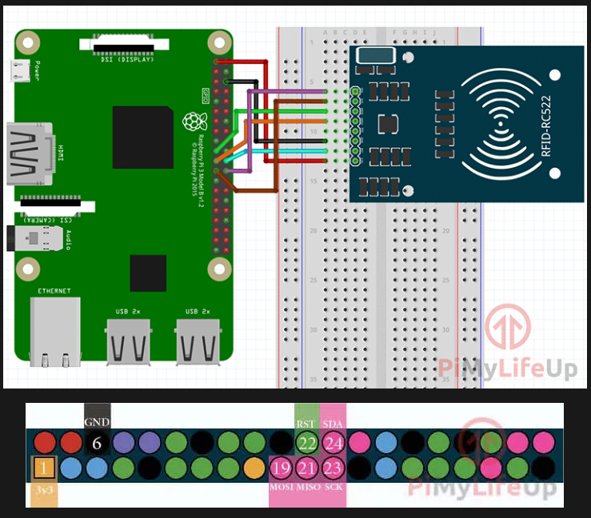
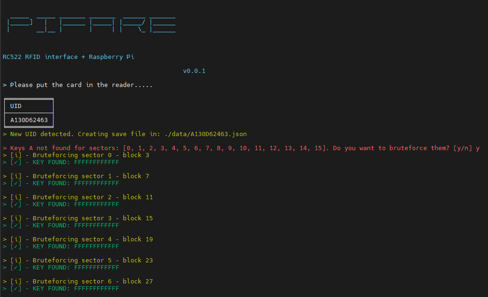
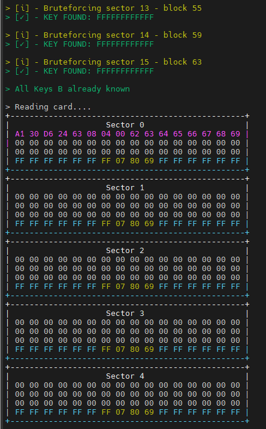
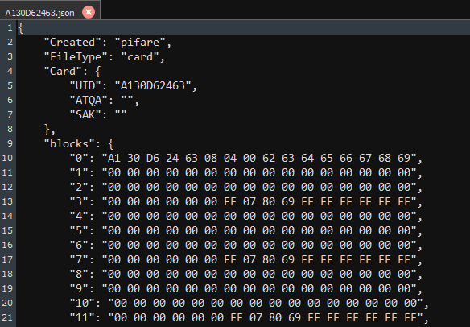
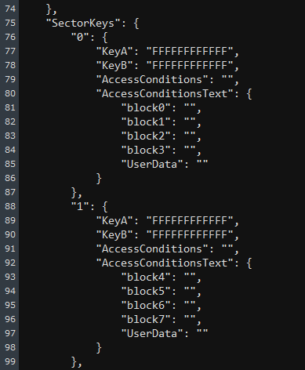

# 💳 About PiFare
PiFare is a Raspberry Pi tool for reading Mifare classic 1k cards with a RC522 module via SPI. This project is for fun and for learn RFID related things.

PiFare is based on these projects (I have changed the prints for working with Python3): 

* MFRC522-python: https://github.com/mxgxw/MFRC522-python (using it for reading with the RC522 module)
* SPI-Py: https://github.com/lthiery/SPI-Py (using commit 8cce26b9ee6e69eb041e9d5665944b88688fca68 to prevent some errors)


# 📝Installation 

1. First, you need to enable SPI in the Raspberry pi: https://pimylifeup.com/raspberry-pi-spi/

```
sudo raspi-config
```

2. Connect the RC522 with the Raspberry. The wiring is described here ("Wiring the RFID RC522"): https://pimylifeup.com/raspberry-pi-rfid-rc522/



3. To install needed libs, execute the install script: 
```
./installation/install.sh
```

# 💻 Usage 
Run the script with python3: 
```
python PiFare.py
```

The script will ask for a card and read the UID. Then, it ask you if you want to bruteforce the keys (first KeysA, after that, it does the same process for KeysB) with the dictionary in the "dict" folder which contains around 1400 keys. 



If you found some Keys, the script will read the data from the different blocks: 



All the information related to the card read is saved in /data/{UID}.json file (I have copied the same structure as the proxmark uses). If you open the file, you can see the keys, the content of the blocks read, etc. 



